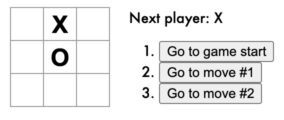

# About Repository

본 저장소는 React를 공부하고 정리한 내용을 담고 있습니다.

[A JavaScript library for building user interfaces : React](https://reactjs.org)

 

## Contents

- React Tutorial (/react-tutorial) [Tutorial](https://reactjs.org/tutorial/tutorial.html) / [Notion](https://distinct-bulb-c95.notion.site/React-91f8d26768b94fb2a0aa272c01d18df1) / [소스 코드( index.js )](../index.js)